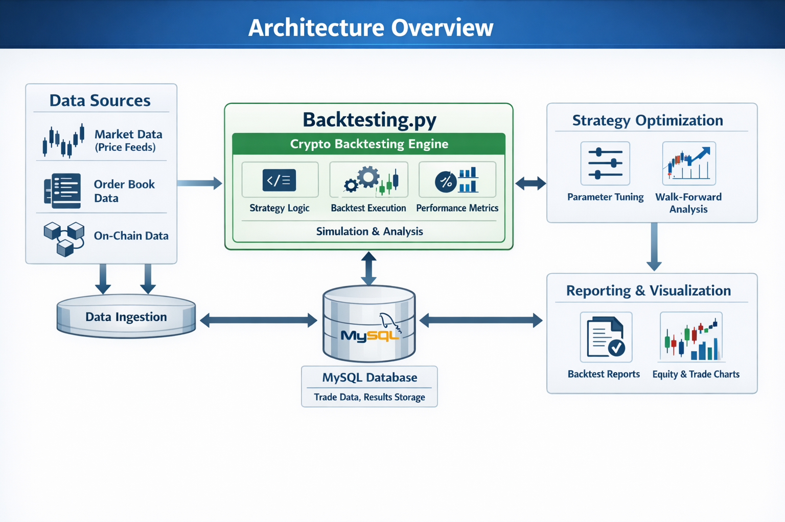
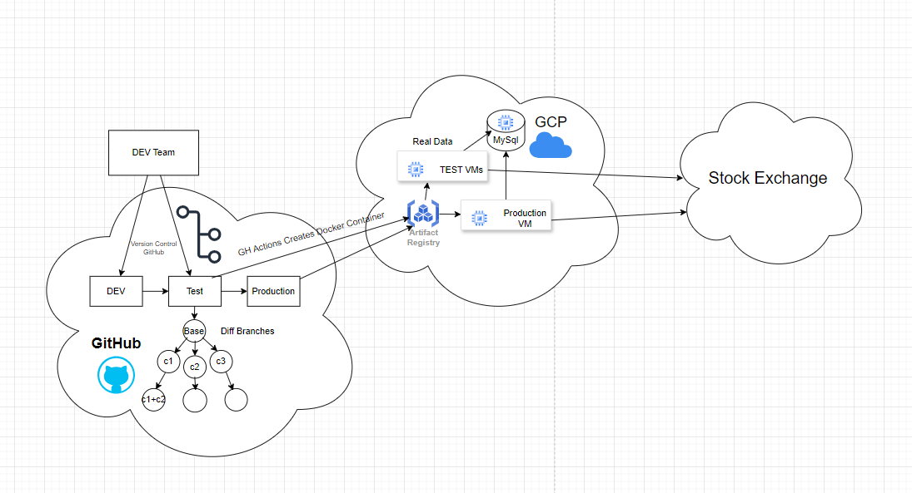
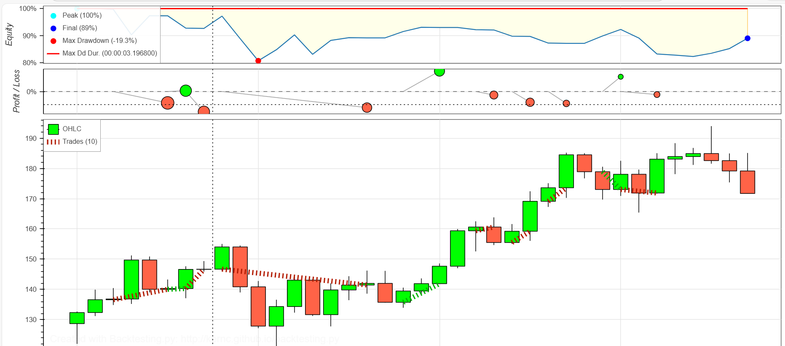
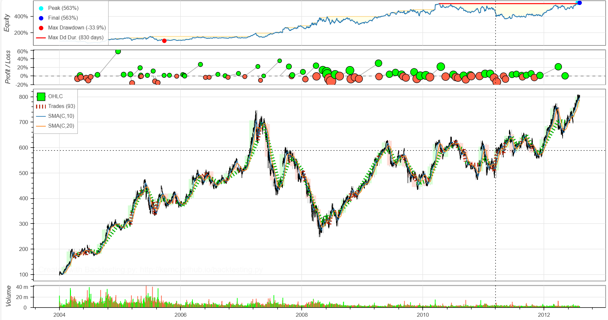

# 🚀 Crypto Backtesting Engine

## Architecture Overview

The system is built around **Backtesting.py** and uses **MySQL as the communication backbone** between all modules.

### Core Design Principles

- Database-driven service communication
- Deterministic and reproducible backtests
- Modular strategy architecture
- Clear separation between ingestion, execution, optimization, and reporting
- No MLOps components — purely research-focused infrastructure

All services exchange state, signals, and results through structured MySQL tables.

---

# 📌 Project Description

The **Crypto Backtesting Engine** is a modular quantitative research framework designed for cryptocurrency markets.

It enables:

- Historical strategy simulation
- Indicator-based signal modeling
- Parameter optimization
- Performance analytics
- Comparative benchmarking
- Risk analysis

The system supports both classical technical strategies and ML-enhanced signal models, executed through a structured backtesting workflow powered by `Backtesting.py`.

---
# 🚀 DevOps Methodology (GitHub Actions + GCP)

The project uses a lightweight CI/CD pipeline built with **GitHub Actions** and **Google Cloud Platform (GCP)**.

### CI Process
- Developers work in feature branches.
- Push or Pull Request triggers GitHub Actions.
- Pipeline runs tests, validates strategies, and builds a Docker image.
- Image is pushed to **GCP Artifact Registry**.

### CD Process
- TEST VMs pull the new container for validation.
- After approval, Production VM is updated.
- Production connects to:
  - MySQL (data & results)
  - Stock exchange APIs

### Key Benefits
- Automated testing before deployment
- Containerized, reproducible environments
- Clear separation: Dev → Test → Production
- Versioned and immutable deployments

This setup enables fast strategy iteration while maintaining production stability.
---

# 🏗 System Components

### 1️⃣ Data Ingestion
- OHLCV price feeds
- Order book data
- On-chain metrics
- Data normalization & validation
- Persisted in MySQL

### 2️⃣ Strategy Layer
- Indicator pipelines (SMA, MACD, RSI, etc.)
- Sliding window features
- Signal generation
- Parameter configuration

### 3️⃣ Backtesting Engine
- Trade execution modeling
- Commission & slippage handling
- Portfolio equity tracking
- Drawdown tracking
- Risk metric computation

### 4️⃣ Optimization Module
- Parameter sweeps
- Walk-forward testing
- Multi-strategy comparison

### 5️⃣ Reporting & Visualization
- Equity curves
- Trade overlays
- Performance metrics
- Drawdown visualization

---

# 📊 Strategy Results & Analysis

---

## 🔹 1. Short-Term Backtest Example

### Analysis

- Peak equity: 100%
- Final equity: 89%
- Max drawdown: -19.3%
- Short drawdown duration

This short-window strategy demonstrates:

- Moderate volatility exposure
- Controlled downside risk
- Frequent trade activity
- Tight equity oscillations

Suitable for:
- High-frequency parameter tuning
- Micro-structure experimentation
- Short-horizon signal validation

---

## 🔹 2. Long-Term Strategy Performance

### Analysis

- Peak return: 563%
- Max drawdown: -33.9%
- Drawdown duration: 830 days
- Strong long-term equity expansion

Observations:

- Clear trend-capturing behavior
- Sustained compounding
- Acceptable drawdown profile relative to return
- Strong resilience during market cycles

This suggests:
- Effective trend-following logic
- Good risk-adjusted return over macro cycles

---

## 🔹 3. Strategy Comparison (ML vs Buy & Hold)

### Analysis

- ML Strategy significantly outperforms Buy & Hold
- Strong compounding from 2018–2025
- Lower volatility clustering compared to benchmark
- Superior cumulative return growth

Insights:

- Active signal generation improves capital efficiency
- Market timing reduces drawdown exposure
- Adaptive behavior outperforms passive allocation

---

## 🔹 4. MACD + RSI Optimization

### Analysis

- Multi-indicator confirmation reduces false signals
- Clear trade clustering around momentum shifts
- Balanced win/loss distribution
- Enhanced signal precision

This configuration demonstrates:

- Improved entry timing
- Reduced whipsaw behavior
- Parameter sensitivity tuning capability

---

## 🔹 5. Sliding Window Prediction (Actual vs Predicted)

*(Replace with correct sliding window image path if different)*

### Analysis

- Close tracking between predicted and actual targets
- Captures directional shifts
- Occasional over/under-shoot during volatility spikes

Indicates:

- Model captures short-term momentum patterns
- Prediction lag present during sharp reversals
- Usable as signal enhancement layer

---

# 📈 Risk & Performance Metrics Captured

- Total Return
- CAGR
- Sharpe Ratio
- Max Drawdown
- Drawdown Duration
- Win Rate
- Profit Factor
- Exposure Time
- Volatility
- Trade Distribution

---

# ⚙️ Technology Stack

- Python 3.x
- Backtesting.py
- Pandas
- NumPy
- Matplotlib
- MySQL
- SQLAlchemy (optional ORM layer)

---