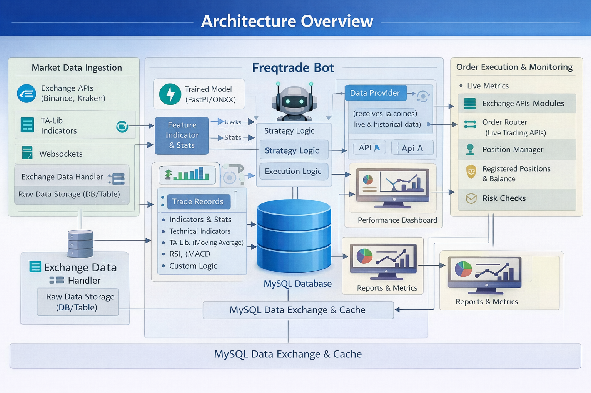

# Crypto Live Engine (Crypto_live Egine)
**Freqtrade Integration with Live Trading Strategy Workflow (via MySQL)**

Crypto Live Engine is a lightweight workflow layer around **Freqtrade** for **live crypto trading** where all services/modules **communicate through a shared MySQL database** (no MLOps tooling, no Redis/event bus required).

## Architecture Overview

> 

The system is organized into a few clear responsibilities:

- **Market Data Ingestion**: pulls exchange market data and stores normalized candles/tickers in MySQL.
- **Freqtrade Bot**: consumes market data, runs strategy logic, and produces signals/trades.
- **Order Execution & Monitoring**: routes orders to exchange APIs, tracks positions, balances, and live metrics.
- **Reporting & Dashboards**: reads MySQL for performance, logs, metrics, and operational visibility.
---
# 🚀 DevOps Methodology (GitHub Actions + GCP)

The project uses a lightweight CI/CD pipeline built with **GitHub Actions** and **Google Cloud Platform (GCP)**.

### CI Process
- Developers work in feature branches.
- Push or Pull Request triggers GitHub Actions.
- Pipeline runs tests, validates strategies, and builds a Docker image.
- Image is pushed to **GCP Artifact Registry**.

### CD Process
- TEST VMs pull the new container for validation.
- After approval, Production VM is updated.
- Production connects to:
  - MySQL (data & results)
  - Stock exchange APIs

### Key Benefits
- Automated testing before deployment
- Containerized, reproducible environments
- Clear separation: Dev → Test → Production
- Versioned and immutable deployments

This setup enables fast strategy iteration while maintaining production stability.

## Key Goals

- **One source of truth**: MySQL stores market data, signals, orders, positions, and metrics.
- **Loose coupling**: modules interact via MySQL tables (polling or scheduled reads/writes).
- **Simple operations**: minimal infrastructure dependencies.

---

## Components

### 1) Market Data Ingestion
**Responsibilities**
- Fetch OHLCV/candles, tickers, order-book snapshots (optional) from exchange APIs and/or websockets.
- Normalize symbols/timeframes and store in MySQL.
- Track ingestion health (lag, missing candles, API errors).

**Writes to MySQL**
- `market_candles`
- `market_tickers` (optional)
- `ingestion_status`
- `system_logs`

### 2) Freqtrade Bot (Strategy Core)
**Responsibilities**
- Read latest candles from MySQL (or via Freqtrade’s normal exchange connector while still persisting to MySQL).
- Compute indicators and strategy rules.
- Generate signals and/or place trades (depending on configuration).
- Persist outcomes for auditability.

**Reads from MySQL**
- `market_candles`
- `strategy_config`
- `risk_limits`

**Writes to MySQL**
- `strategy_signals`
- `trades`
- `positions`
- `bot_status`
- `system_logs`

### 3) Order Execution & Management
**Responsibilities**
- Convert validated signals into exchange orders.
- Maintain position state, fills, fees, and balances.
- Apply risk checks (max exposure, leverage limits, max open trades, cooldowns).
- Provide operational monitoring and failure handling.

**Reads from MySQL**
- `strategy_signals`
- `risk_limits`
- `exchange_accounts`

**Writes to MySQL**
- `orders`
- `order_fills`
- `positions`
- `balances`
- `execution_metrics`
- `system_logs`

### 4) Reporting & Dashboard
**Responsibilities**
- Track PnL, drawdown, win rate, exposure, and bot health.
- Provide “what happened and why” visibility using stored signals + trades + market context.

**Reads from MySQL**
- `trades`, `orders`, `order_fills`, `positions`, `balances`
- `strategy_signals`
- `execution_metrics`, `bot_status`, `ingestion_status`

---

## Data Flow (High Level)

1. **Ingestion** stores fresh market data in `market_candles`.
2. **Freqtrade** reads candles → computes indicators → writes signals into `strategy_signals`.
3. **Execution** reads new signals → runs risk checks → writes orders into `orders` and updates `positions`.
4. **Reporting** reads everything from MySQL to visualize performance and system status.

---

## Database (Suggested Tables)

> You can adapt naming to your existing schema; these are typical “starter” tables.

### Market & Ingestion
- `market_candles(symbol, timeframe, open_time, open, high, low, close, volume, source, created_at)`
- `ingestion_status(component, last_seen_ts, lag_seconds, status, updated_at)`

### Strategy
- `strategy_config(key, value, updated_at)`
- `strategy_signals(id, ts, symbol, timeframe, signal_type, confidence, reason, payload_json, created_at)`
- `bot_status(bot_id, ts, mode, state, heartbeat_ts, message)`

### Execution
- `orders(id, ts, symbol, side, type, qty, price, status, exchange_order_id, created_at)`
- `order_fills(id, order_id, ts, qty, price, fee, fee_asset, created_at)`
- `positions(symbol, qty, avg_entry, unrealized_pnl, realized_pnl, updated_at)`
- `balances(asset, free, locked, updated_at)`
- `risk_limits(key, value, updated_at)`
- `execution_metrics(ts, metric, value, tags_json)`

### Observability
- `system_logs(id, ts, component, level, message, context_json)`

---

## Local Development

### Prerequisites
- Docker + Docker Compose (recommended) **or** local installs of:
  - MySQL 8.x
  - Python (matching your Freqtrade environment)
  - Freqtrade

### Quick Start (Typical)
1. Start MySQL.
2. Apply schema migrations (SQL scripts).
3. Start **Market Data Ingestion** service.
4. Start **Freqtrade** with the configured strategy.
5. Start **Order Execution & Monitoring** service.
6. Open dashboard/reporting.

---

## Configuration

Common configuration values (store in env vars or MySQL `strategy_config`):

- `MYSQL_HOST`, `MYSQL_PORT`, `MYSQL_DB`, `MYSQL_USER`, `MYSQL_PASSWORD`
- `EXCHANGE_NAME` (e.g., Binance, Kraken)
- `SYMBOLS` (e.g., `BTC/USDT, ETH/USDT`)
- `TIMEFRAMES` (e.g., `1m,5m,1h`)
- `RISK_MAX_OPEN_TRADES`, `RISK_MAX_EXPOSURE_PCT`, `RISK_COOLDOWN_SECONDS`

---

## Operational Notes

### Reliability
- Use idempotent writes (unique keys on candle timestamps, order IDs).
- Track component heartbeats (`bot_status`, `ingestion_status`).
- Implement “signal claiming” to prevent duplicate execution:
  - e.g., add `claimed_by`, `claimed_at`, `status` columns in `strategy_signals`.

### Security
- Never store exchange API secrets in plaintext tables.
- Use environment secrets management (Docker secrets, vault, encrypted env files).
- Restrict DB permissions per module (least privilege).

### Auditing
- Keep full traceability:
  - signal → risk check decision → order → fill → resulting position/trade

