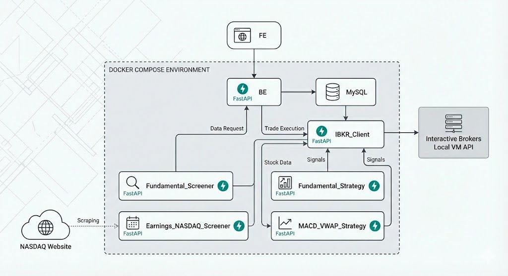

# Algorithmic Trading Microservices Architecture

An automated, containerized algorithmic trading system built with Docker Compose, FastAPI, and MySQL. This system integrates directly with Interactive Brokers (IBKR) to execute trades based on fundamental analysis, standard deviation (STD) filtering, and technical indicators (MACD & VWAP).

---

## 🛠️ Technology Stack

* **Infrastructure:** Docker, Docker Compose
* **Microservices Framework:** FastAPI (Python)
* **Database:** MySQL
* **Brokerage Integration:** Interactive Brokers (IBKR) API via a Local Gateway/VM
* **Web Scraping:** Beautiful Soup / Selenium / Playwright (for NASDAQ)

## 🏗️ Architecture Overview

The system is designed as a distributed microservices architecture to ensure scalability, fault isolation, and separation of concerns. The environment is entirely containerized using Docker Compose.

---

## 📦 Microservices Breakdown

### 1. Frontend (FE)
The user interface of the trading system. 
* **Responsibilities:** Displays current account balance, open positions, and historical closed positions.
* **Communication:** Communicates exclusively with the `BE` service via REST API to retrieve real-time data and account metrics.

### 2. Backend (BE)
The core aggregator for the user interface. Built with FastAPI.
* **Responsibilities:** Serves as the bridge between the UI and the underlying trading mechanics. 
* **Communication:** Queries the `MySQL` DB for local records and talks to the `IBKR_Client` to fetch real-time data regarding balances and the status of open/closed positions.

### 3. IBKR_Client
The central execution and data-fetching hub for the brokerage. Built with FastAPI.
* **Responsibilities:** Acts as the single point of entry to the external Interactive Brokers Local VM API. By funneling all external IBKR requests through this service, rate limits and API connections are managed centrally.
* **Communication:** Receives account info requests from `BE`, top gainer data requests from `Fundamental_Screener`, and trade execution signals from the Strategy services.

### 4. Database (MySQL)
The central source of truth for the system state and market data.
* **Responsibilities:** Stores filtered stock data from screeners, historical trade data, application states, and logs. It decouples the data ingestion (screeners) from the data processing (strategies).

---

### 🔎 Screeners (Data Ingestion)

#### Fundamental_Screener
* **Responsibilities:** Queries the `IBKR_Client` for the top daily gainers. It applies fundamental analysis and calculates the Standard Deviation (STD) to isolate stocks with the highest statistical probability of a continued upward trajectory.
* **Communication:** Writes the successfully filtered stocks directly to the `MySQL` DB.

#### Earnings_NASDAQ_Screener
* **Responsibilities:** A web-scraping service targeting the NASDAQ website. It pulls a list of companies scheduled to report earnings in the upcoming week and classifies them based on historical profitability and expected earnings beats.
* **Communication:** Writes the classified earnings watchlists to the `MySQL` DB.

---

### 📈 Strategies (Trade Execution)

#### Fundamental_Strategy
* **Responsibilities:** A long-only strategy service. It monitors the `MySQL` DB for stocks newly deposited by the screeners that pass the profitable STD analysis. 
* **Communication:** Reads stock candidates from `DB`. Upon identifying a match, it sends a signal to the `IBKR_Client` to enter a long position.

#### MACD_VWAP_Strategy
* **Responsibilities:** A technical indicator strategy. It pulls the watchlist generated by the screeners from the `MySQL` DB and calculates real-time Volume Weighted Average Price (VWAP) and Moving Average Convergence Divergence (MACD). 
* **Communication:** Reads from `DB`. Uses these indicators to determine precise entry points and trade directions (long or short), then sends execution signals to the `IBKR_Client`.

---

# 🚀 DevOps Methodology (GitHub Actions + GCP)

The project uses a lightweight CI/CD pipeline built with **GitHub Actions** and **Google Cloud Platform (GCP)**.

### CI Process
- Developers work in feature branches.
- Push or Pull Request triggers GitHub Actions.
- Pipeline runs tests, validates strategies, and builds a Docker image.
- Image is pushed to **GCP Artifact Registry**.

### CD Process
- TEST VMs pull the new container for validation.
- After approval, Production VM is updated.
- Production connects to:
  - MySQL (data & results)
  - Stock exchange APIs

### Key Benefits
- Automated testing before deployment
- Containerized, reproducible environments
- Clear separation: Dev → Test → Production
- Versioned and immutable deployments

This setup enables fast strategy iteration while maintaining production stability.

## 🔄 Data Flow: The Lifecycle of a Trade

1. **Discovery:** The `Earnings_NASDAQ_Screener` and `Fundamental_Screener` gather market data, apply their respective logic (Earnings classifications / STD analysis), and write the resulting "watchlist" into the `MySQL Database`.
2. **Analysis:** The `Fundamental_Strategy` and `MACD_VWAP_Strategy` continuously poll the `Database` for these new watchlist entries.
3. **Trigger:** Once a strategy calculates that a specific stock from the DB meets its entry criteria (e.g., VWAP crosses MACD in a favorable direction), it formulates an order.
4. **Execution:** The strategy sends a POST request with the order details to the `IBKR_Client`.
5. **Fulfillment:** The `IBKR_Client` forwards the order to the actual Interactive Brokers VM.
6. **Reporting:** The `Frontend` requests a status update via the `Backend`, which in turn asks the `IBKR_Client` and `Database` for the new open positions and updated cash balances, rendering it to the user.