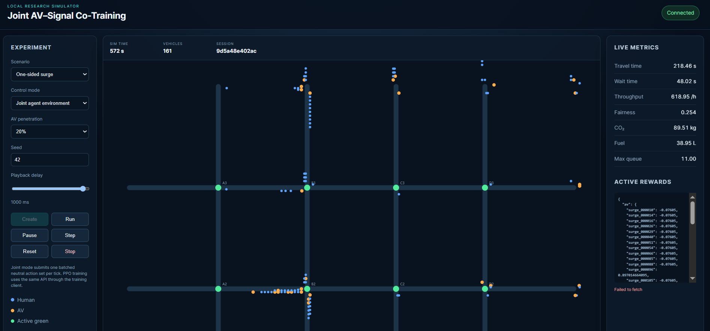
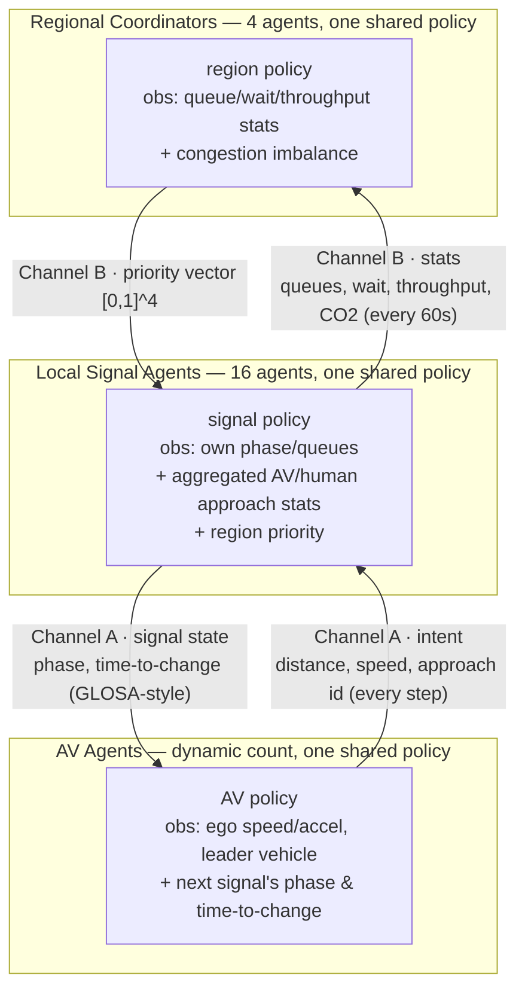
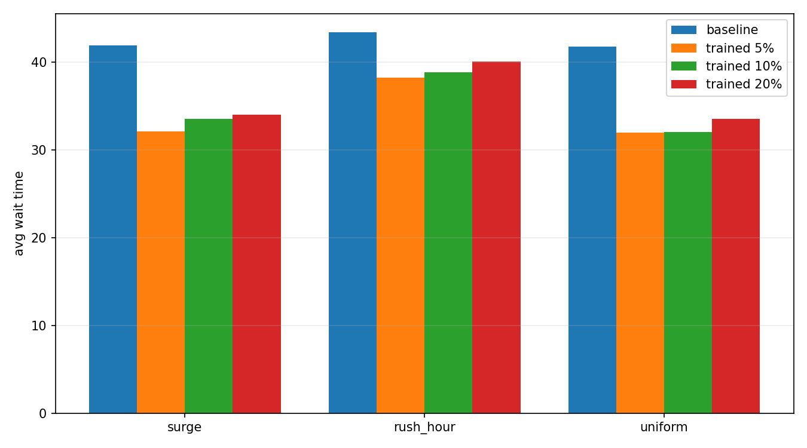
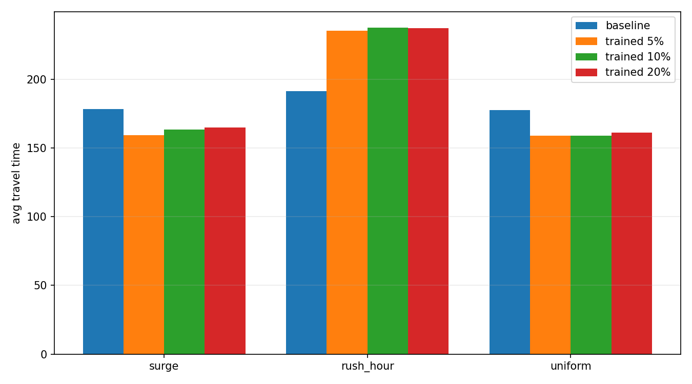
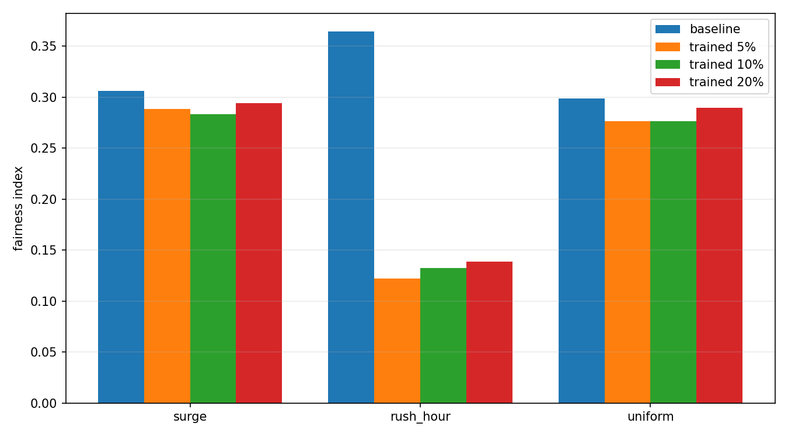
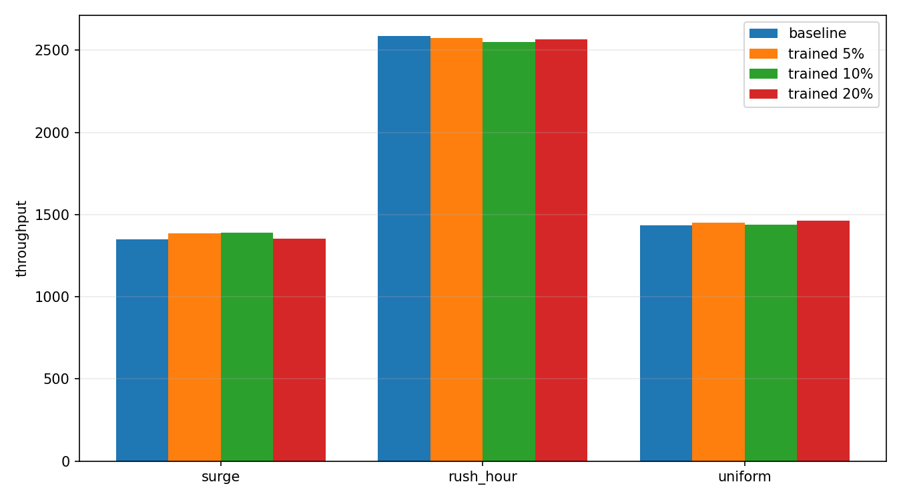
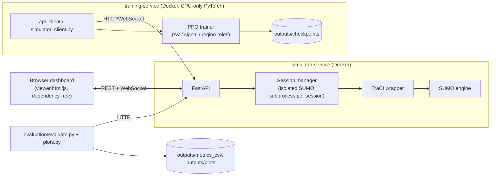

# Joint AV–Signal Co-Training

**Autonomous vehicles and city traffic signals that learn to talk to each other — and both act on
what they hear — trained end-to-end with multi-agent PPO inside a SUMO traffic simulation.**


> 
> Live browser dashboard: a 4×4 grid of signalized intersections, 5–20% autonomous vehicles (orange)
> mixed with human traffic (blue), streamed metrics, and the live reward payload each agent is
> currently optimizing.

---

## What this is

This is a research prototype that trains three cooperating families of reinforcement-learning
agents inside a synthetic 4×4-block city, simulated with [SUMO](https://sumo.dlr.de/):

- **AV agents** — one shared policy controlling the low-level driving (acceleration, lane choice)
  of every autonomous vehicle in the fleet (5%, 10%, or 20% of all traffic; the rest is ordinary
  human-driven SUMO traffic).
- **Local signal agents** — one shared policy controlling the phase timing of all 16 intersections.
- **Regional coordinator agents** — one shared policy per group of 4 intersections (4 regions
  total), giving each local signal longer-horizon, city-aware guidance.

All three roles are trained **jointly, at the same time, in the same running simulation**, with a
lightweight PPO implementation written from scratch in PyTorch (no RLlib/Stable-Baselines
dependency).

The whole thing ships as two Docker services — a SUMO/TraCI/FastAPI simulator and a CPU-only
training container — plus a dependency-free browser dashboard for watching sessions live.

## Why it's interesting

Most traffic-signal RL papers either (a) coordinate signals hierarchically but treat every vehicle
as an anonymous physics object, or (b) teach AVs to drive well in mixed traffic but leave the
signals dumb and static. This project does both **and connects them directly**: an approaching AV
and the intersection it's approaching exchange information every step, and each conditions its
decision on what the other told it.



The key design constraint — and the part that makes it more than a toy — is that **no observation
or message grows with the number of vehicles or intersections**. A signal never sees "all AVs near
it," it sees a fixed-size aggregated feature vector (count, mean distance, mean speed) per approach.
A region never sees "the whole city," only stats from its 4 member intersections. That's what lets
the same three small MLP policies scale from a handful of vehicles to a full rush-hour demand load
without retraining or resizing anything.

Training uses **Centralized Training, Decentralized Execution**: critics may see privileged
information during training (e.g. a signal's critic can see its whole region's state), but the
deployed actors only ever see what the communication channels above actually deliver — so what's
trained is what could actually be deployed.

### Communication in detail

| Channel | Direction | Payload | Frequency |
|---|---|---|---|
| A — AV ↔ Signal | AV → Signal | per-approach aggregate: AV count, mean distance, mean speed, human count, human mean speed | every sim step (1s) |
| A — AV ↔ Signal | Signal → AV | current phase id, seconds until phase change, next phase id (GLOSA-style "ease off, you'll hit red") | every sim step (1s) |
| B — Signal ↔ Region | Signal → Region | per-approach queue lengths, avg wait, throughput, CO2 last interval | every 60s |
| B — Signal ↔ Region | Region → Signal | priority vector `Box(4,)` in `[0,1]`, one scalar per member intersection (a *nudge*, not an override — the local signal still decides) | every 60s |

There is deliberately **no AV-to-AV messaging** — vehicles coordinate implicitly through the shared
reward and SUMO's own car-following/safety constraints, avoiding an O(N²) messaging scheme.

## Environment & agents at a glance

| Role | Instances | Decision interval | Observation | Action |
|---|---|---|---|---|
| AV | dynamic (5–20% of ~800–5300 vehicles/episode) | every 1s | 9-dim: ego speed/accel, leader distance/speed, distance to stop line, lane index, next signal's phase/time-to-change/next-phase | `Box(2,)`: target acceleration, lane-change intent |
| Local signal | 16 (fixed) | every 5s | own phase + queues/speeds per approach, aggregated AV/human approach stats, region priority, one-hot intersection id | `Discrete(2)`: extend current phase / switch to next phase |
| Regional coordinator | 4 (fixed) | every 60s | mean/max queue, mean wait, throughput, emissions, congestion-imbalance (stddev) across 4 members, one-hot region id | `Box(4,)` in `[0,1]`: per-member priority |

Each role is a small 2×64 ReLU MLP (Gaussian head for AVs and regions, categorical head for
signals) — intentionally simple and CPU-trainable, per the project's "16GB RAM, no GPU" target
hardware. All three are trained together with GAE advantages, a clipped PPO objective, 4 epochs per
update, and shared policy weights across every agent instance of a given role (an intersection ID /
region ID one-hot lets the shared network still specialize per location).

The reward is multi-objective (throughput + fairness + emissions), computed by
[env/reward_calculator.py](env/reward_calculator.py):

- **AV**: progress toward target speed − harsh-braking penalty − CO2 penalty + a shared term pulled
  from its next signal's reward (so an AV is nudged to help the intersection it's approaching, not
  just itself).
- **Signal**: throughput − wait-time increase − Jain's-fairness-index penalty across its 4 approaches
  − emissions + a small alignment bonus from its region's priority.
- **Region**: throughput − mean wait − fairness penalty across its 4 members − emissions.

## Three demand scenarios

| Scenario | Duration | Shape |
|---|---|---|
| `surge` | 30 min | Flat baseline demand, one entry point spikes to 4× for 10 minutes (models an event letting out on one side of the city) |
| `rush_hour` | 2 h | Full peak profile: low → ramp → 2× peak (45 min) → taper |
| `uniform` | 30 min | Flat, moderate demand everywhere — the control condition |

Each is defined declaratively in [config/scenario_*.yaml](config) as a piecewise demand multiplier
curve, fed into [demand/generate_demand.py](demand/generate_demand.py).

## Results

Evaluation compares the trained joint system against a fixed-time signal baseline (static 30s
green / 3s yellow / 2s all-red cycles, 100% human traffic — today's status quo), across all 3
scenarios × 3 AV penetration rates, from [outputs/metrics_csv](outputs/metrics_csv) /
[evaluation/plots.py](evaluation/plots.py):

<table>
<tr>
<td></td>
<td></td>
</tr>
<tr>
<td></td>
<td></td>
</tr>
</table>

More charts (CO2, fuel, max queue) are in [outputs/plots/](outputs/plots/).

**Read honestly, not cherry-picked:** on `surge` and `uniform`, the trained system cuts average
wait time by ~19–23% and travel time by ~7–11% at every penetration rate, with a small throughput
gain. On `rush_hour` — the highest-load, longest scenario — the checked-in checkpoints currently
land *worse* than the static baseline on travel time and fairness. That's the honest result of a
proof-of-concept training budget (3 curriculum iterations × 2048 steps by default, see
[Using it for real research](#using-it-for-real-research) below), not a claim that the approach
fails under load — it's the clearest signal in the repo for where more training time / reward
tuning should go next.

## Quickstart (Docker)

Requirements: Docker Engine + Compose, a browser, ~2 GB free image space.

```bash
cp .env.example .env
make up             # builds & starts simulator-service + training-service
make smoke-test     # create a session, step it 50 times, check metrics (<1 min)
```

Open **http://127.0.0.1:8000** — that's the dashboard shown at the top of this page.

1. Pick a scenario (`surge` / `rush_hour` / `uniform`).
2. Pick a control mode: fixed-time baseline, or the joint-agent environment.
3. Pick AV penetration (5/10/20%) and a seed.
4. **Create** → **Run**. Pause, single-step, reset, and playback speed all work live.
5. Watch vehicle positions (AV vs. human), active signal phases, cumulative metrics, and the exact
   reward payload each agent is receiving right now.

The browser's own "joint-agent" control submits neutral actions on purpose, so it can stay a
dependency-free client of the public API. To actually watch the **trained PPO policies** drive:

```bash
make replay PENETRATION=0.20 REPLAY_SCENARIO=surge
```

This opens the same dashboard against a fresh session, driven by the corresponding
`outputs/checkpoints/m7_*_p20.pt` weights. Ctrl+C stops it and tears the session down.

```bash
make down            # stop everything
```

### Other useful commands

```bash
make logs                                          # follow simulator logs
make train PENETRATION=0.05                        # 3 curriculum iterations, 2048 steps
make train PENETRATION=0.10 TRAINING_ITERATIONS=10 ROLLOUT_STEPS=4096   # longer run
make evaluate                                       # full 3x3 grid + regenerate all plots
```

`make train` writes shared-policy weights to `outputs/checkpoints/` and prints one JSON record per
iteration (finite `av_loss` / `signal_loss` / `region_loss`, nonzero transition counts for all three
roles). `make evaluate` writes `outputs/metrics_csv/trained.csv`, `improvements.csv`, and the seven
grouped charts shown above.

## Architecture



- **`simulator-service`**: SUMO + TraCI + FastAPI + the static browser viewer, one port (8000),
  every session gets its own isolated SUMO subprocess. This is the only container that talks to
  SUMO directly.
- **`training-service`**: CPU-only PyTorch, PPO, evaluation, plotting. No SUMO installed — it is
  just another HTTP/WebSocket client of `simulator-service`, exactly like the browser or any
  external researcher's script. `./outputs` is bind-mounted so checkpoints/CSVs/plots persist on
  the host.
- Binding defaults to `127.0.0.1` only; there is no auth in V1, so only widen
  `SIMULATOR_BIND_ADDRESS` on a trusted network.

## External API

Interactive OpenAPI docs live at `http://127.0.0.1:8000/docs`. Minimal external workflow:

```bash
curl -X POST http://127.0.0.1:8000/sessions \
  -H 'content-type: application/json' \
  -d '{"scenario":"surge","penetration_rate":0.05,"seed":42,"config_overrides":{},"mode":"trained"}'

curl http://127.0.0.1:8000/sessions/SESSION_ID/observations

curl -X POST http://127.0.0.1:8000/sessions/SESSION_ID/actions \
  -H 'content-type: application/json' \
  -d '{"av_actions":{},"signal_actions":{},"region_actions":{}}'

curl -X POST http://127.0.0.1:8000/sessions/SESSION_ID/step \
  -H 'content-type: application/json' -d '{"n_steps":1}'

curl http://127.0.0.1:8000/sessions/SESSION_ID/metrics
curl -X DELETE http://127.0.0.1:8000/sessions/SESSION_ID
```

Live state/reward streaming: `ws://127.0.0.1:8000/sessions/SESSION_ID/stream?every_n=1`
(read-only — actions stay batched REST calls). Up to 4 sessions run concurrently by default; idle
sessions are cleaned up after 10 minutes.

## Local development without Docker

```bash
python3 -m venv .venv
.venv/bin/python -m pip install -r requirements.txt
.venv/bin/python network/generate_grid.py
.venv/bin/python demand/generate_demand.py
.venv/bin/uvicorn api.main:app --host 127.0.0.1 --port 8000
```

Point client commands at `SIMULATOR_API_URL=http://127.0.0.1:8000`. On Linux the pip SUMO wheel may
need system `libGL.so.1` / `libXrender.so.1` (the Docker image installs these automatically).

Run the test suite (8 files covering network generation, observation shapes, reward math,
communication-channel size bounds, baseline metrics, env smoke tests, evaluation outputs, and API
contract):

```bash
.venv/bin/python -m unittest discover -s tests -v
```

## Using it for real research

The checked-in config/checkpoints are proof-of-concept values, not tuned scientific conclusions.
For a defensible experiment:

1. Keep one immutable config + checkpoint set per experimental condition.
2. Run the fixed-time baseline and the trained policy with matched scenario, demand, and seed.
3. Repeat across multiple unseen seeds — the single default evaluation seed is not a confidence
   interval. Report mean, dispersion, and replication count.
4. Use the 3×3 scenario/penetration grid as the primary comparison, then ablate: AV control, local
   signals alone, regional coordination, Channel A, Channel B.
5. Report travel/wait time, throughput, fairness, CO2, fuel, max queue, and SUMO
   teleports/collisions — don't cherry-pick favorable metrics (see the honest `rush_hour` result
   above).
6. Preserve `config/*.yaml`, seeds, checkpoint hashes, CSVs, plots, image IDs, and code revision
   with every result.

All `[TUNABLE]` values — reward weights, demand curves, PPO hyperparameters, session timeout,
concurrent-session limit — live in [config/default.yaml](config/default.yaml); change them via a
recorded config or the API's `config_overrides`, not by editing formulas in place.

## Project structure

```
env/           SUMO/TraCI wrapper, PettingZoo-style multi-agent envs, observation/reward builders
agents/        PPO implementation, policy/value networks, rollout buffer
training/      training entry points (per-role, hierarchy, joint, sweep)
api/           FastAPI session service + WebSocket streaming + static browser dashboard
api_client/    HTTP/WebSocket client used by training/evaluation/replay (and by external callers)
baseline/      fixed-time signal controller + baseline metric runs
evaluation/    metrics collection, evaluation grid runner, plotting
replay/        drives the browser viewer with trained checkpoints
network/       synthetic 4x4 SUMO grid generator
demand/        per-scenario demand-curve vehicle generation
config/        default + per-scenario YAML config (all [TUNABLE] values live here)
docker/        simulator & training Dockerfiles
tests/         unittest suite (network gen, envs, rewards, API contract, communication bounds)
outputs/       checkpoints, metrics CSVs, generated plots (bind-mounted from training-service)
```

## Scope notes

- No auth/authorization in V1 — bind only to `127.0.0.1` off a trusted network.
- No AV-to-AV messaging, no 5th city-level coordination tier above the 4 regions, no real
  OSM-imported map, no pedestrian/cyclist modeling, no simulated comms latency/packet loss — see
  `spec_joint_av_signal_cotraining.md` §11 for the full non-goals list and rationale.
- Visualization is the cross-platform browser canvas, not `sumo-gui` in the container — that keeps
  it host-OS independent and X11-forwarding-free, and it's driven by the exact same REST/WebSocket
  boundary used by training and any external client.

## Tech stack

SUMO 1.27 (via TraCI) · PyTorch 2.7 (custom PPO, no RLlib/SB3) · FastAPI + WebSockets ·
Docker Compose · vanilla JS/Canvas for the dashboard (no frontend framework/build step).
