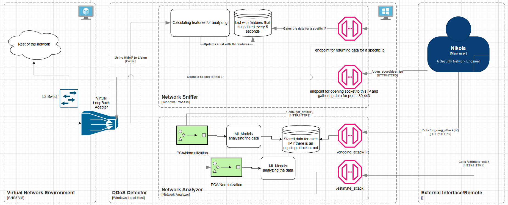
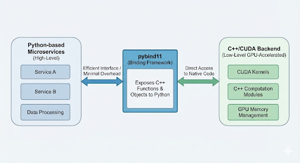
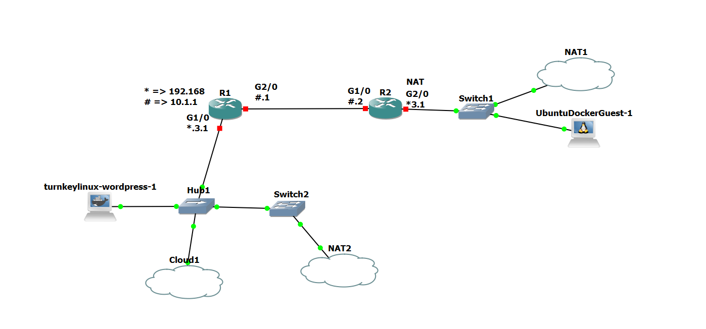
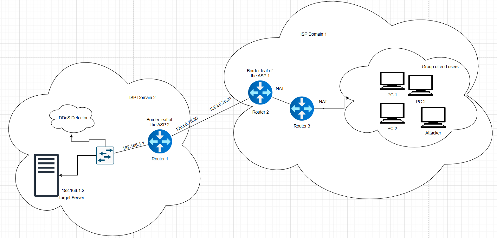
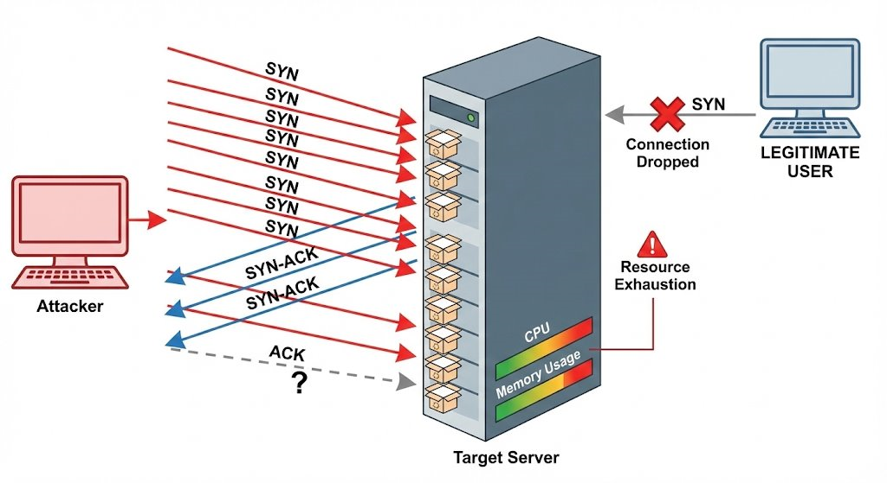
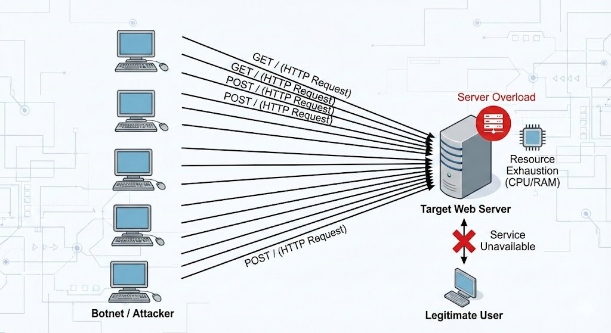
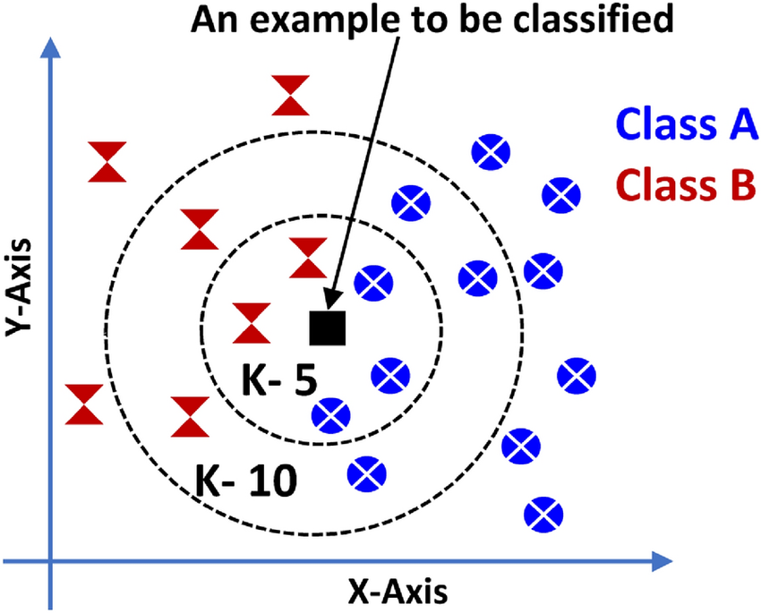
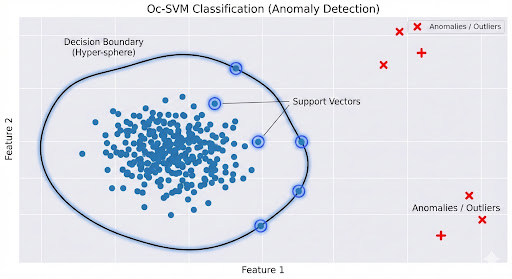

# 🚀 DDoS Detection and Classification System  
### Senior Thesis – Nikola Georgiev (Fall 2025)

---

# 📌 Overview

This project presents a **real-time Distributed Denial of Service (DDoS) detection system** designed for NAT-obscured enterprise environments.

The system combines:

- 📡 Real-time packet capture  
- 📊 Feature engineering over rolling time windows (5s)  
- 🤖 GPU-accelerated ML inference (k-NN & OC-SVM)  
- ⚡ FastAPI-based microservices  
- 🧠 C++/CUDA backend exposed via pybind11  

Validated in a realistic **GNS3 enterprise simulation**, where live SYN Flood and HTTP Flood attacks were generated and analyzed.

---

# 🏢 Business Case

Modern DDoS attacks:

- Overwhelm infrastructure  
- Cause financial & SLA losses  
- Hide behind NAT  
- Mimic legitimate traffic  
- Scale using botnets  

Traditional filtering fails when:

- Multiple users share public IPs  
- Traffic is syntactically valid  
- Identity is masked  

✅ **Solution:**  
A behavior-based anomaly detection system that identifies attack patterns using statistical deviation instead of signatures.

---

# 🎯 Problem Statement

The system must:

- Detect DDoS inside NAT environments  
- Operate without stable source identity  
- Use statistical behavior modeling  
- Analyze traffic in near real-time  
- Handle high throughput efficiently  

---

# 🏗 Architecture

## 🔹 High-Level Design

Two microservices:

---

## 1️⃣ Network Sniffer  
**Python + Scapy + FastAPI**

Responsibilities:

- Capture TCP traffic (80/443)
- Aggregate packets into 5-second windows
- Compute statistical features:
  - Packet rate
  - Byte rate
  - SYN/ACK ratio
  - TCP flag distribution
- Expose REST endpoints:
  - `/open_socket/{ip}`
  - `/get_data/{ip}`

---

## 2️⃣ Network Analyzer  
**Python + C++ + CUDA**

Responsibilities:

- Normalize feature vectors
- Execute ML inference (k-NN / OC-SVM)
- Maintain IP state:
  - `CLEAR`
  - `UNDER_ATTACK`
- Provide endpoints:
  - `/estimate_attack/{ip}`
  - `/ongoing_attack/{ip}`

---

## 🔹 Python ↔ C++/CUDA Integration

- Python orchestrates logic  
- pybind11 bridges native inference  
- C++ handles ML core  
- CUDA accelerates computation  

---

# 🧪 Testing Environment

- Multi-ISP topology  
- NAT boundaries  
- Target Server: `192.168.1.2`  
- Legitimate users + attacker node  

---

# 🔄 System Flow

1. Sniffer listens on network interface  
2. Features computed every 5 seconds  
3. Analyzer normalizes input  
4. ML model classifies  
5. IP state updated  

---

# 🚨 Types of Attacks Evaluated

## 🔴 SYN Flood

- High SYN volume  
- Half-open TCP connections  
- Memory exhaustion  

Detected via:
- SYN spike
- ACK imbalance
- Increased packet rate  

---

## 🔴 HTTP Flood

- Massive GET/POST requests  
- CPU/RAM exhaustion  
- Application-layer overload  

Detected via:
- Byte rate surge  
- Sustained request bursts  

---

# 🤖 Machine Learning Models

## 🟢 k-Nearest Neighbors (k-NN)

- Density-based detection  
- Reacts quickly to spikes  
- Non-parametric  

---

## 🔵 One-Class SVM (OC-SVM)

- Learns boundary of normal traffic  
- Flags outliers  
- RBF kernel performed best  

---

# 📊 Experimental Results

### Model Performance Summary

| Model Name            | ROC-AUC | Recall |
|-----------------------|---------|--------|
| k-NN (k=5)            | 0.96    | 0.92   |
| k-NN + PCA            | 0.96    | 0.92   |
| OC-SVM (Polynomial)   | 0.95    | 0.90   |
| OC-SVM (Linear)       | 0.95    | 0.92   |
| OC-SVM (RBF)          | **0.98**| **0.97** |

### Key Findings

- **OC-SVM (RBF)** achieved highest ROC-AUC  
- **k-NN** reacted faster to sudden anomalies  
- Ensemble potential identified  

Performance validated in live attack simulation.

---

# ⚡ Performance Characteristics

- 5-second rolling window  
- Near real-time detection  
- Per-IP behavioral tracking  
- GPU-accelerated inference  
- Windows-native deployment  

