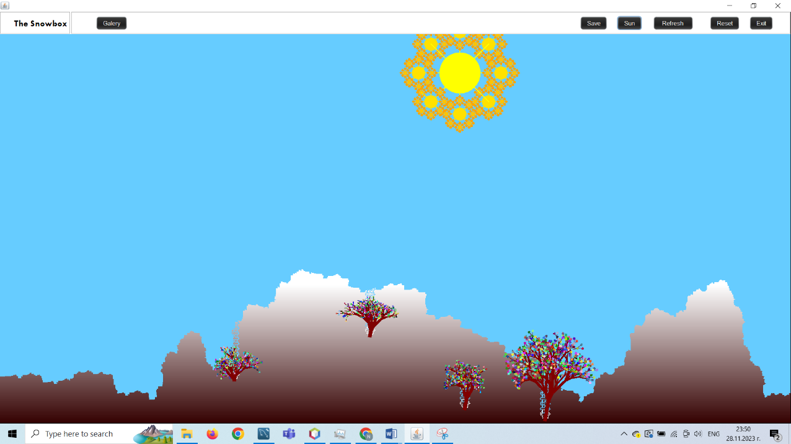
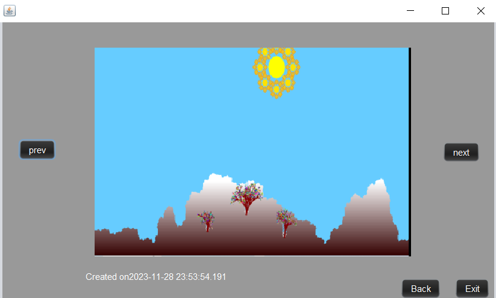

# The Snowbox, a FractalTrees Engine 🌲❄️

A Java Swing app + recursive rendering engine for generating procedural **fractal trees** in a mountainous “Snowbox” scene. Click anywhere on the canvas to spawn falling snowflakes that transform into colorful recursive trees, then add a fractal sun and save your artwork.

---

## UI Preview

### Main App

### Gallery

---

## Features
- **Recursive Depth Control:** tune branching generations (depth) for performance vs detail.
- **Stochastic Variation:** randomness for organic-looking growth (angles, branch shrink, spread).
- **Interactive Scene:** click-to-spawn fractals, animated fall-to-growth behavior.
- **Save & Gallery:** export your generated scene and browse saved renders.

---

## How to Run
1. Open the project in IntelliJ / Eclipse / NetBeans.
2. Ensure you have a JDK installed (Java 8+ recommended).
3. Run the launcher class:
   - `Java_DB_LoginForm.java` *(or your current main entry class if renamed)*

---

## Controls (Quick)
- **Click canvas:** spawn snowflakes → fall → recursively draw trees
- **Sun:** draws a fractal sun on the sky
- **Save:** saves current image
- **Gallery:** browse saved images
- **Refresh / Reset:** regenerate / clear scene (implementation-specific)

---

##  The Mathematics
The fractal tree is generated using **recursive trigonometry**. Starting from a base trunk of length $L$, each branch produces two (or more) child branches at an angle $\theta$.

### Branch Coordinates
To find the endpoint $(x_2, y_2)$ of a branch starting at $(x_1, y_1)$ with length $L$ and angle $\alpha$:

$$x_2 = x_1 + L \cdot \cos(\alpha)$$
$$y_2 = y_1 + L \cdot \sin(\alpha)$$

###  Recursion & Scaling
Each subsequent generation $n$ reduces the length $L$ by a scaling factor $r$ (where $0 < r < 1$):

$$L_n = L_0 \cdot r^n$$

The total number of branches $B$ for a binary tree at depth $d$ is calculated by:

$$B = \sum_{i=1}^{d} 2^i = 2^{d+1} - 2$$

---