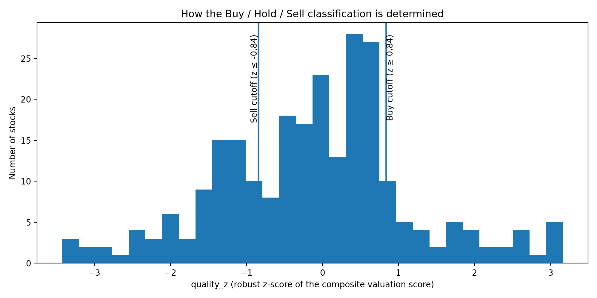
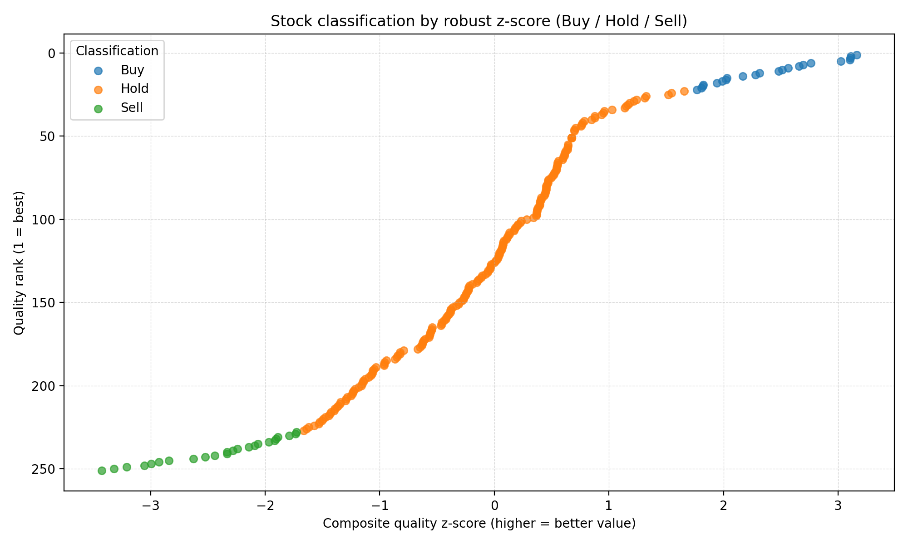

# Portfolio Balancer / Stock Classifier

This project takes a universe of stocks, enriches them with simple **valuation ratios**, computes **robust (outlier-resistant) z-scores**, and then classifies each stock as **Buy / Hold / Sell** based on how its composite score compares to the rest of the universe.




In other words: it’s a *relative-value* screener that uses standard statistical normalization (z-scores) to rank and bucket stocks, and (optionally) pulls recent price history to compute return risk metrics (variance/covariance) for the names that are most “extreme”.


---

## What it does

### 1) Enrich tickers with valuation metrics
`main.py` reads `filtered_stocks.csv` and fetches valuation inputs from Yahoo Finance via `yfinance`, producing:

- **P/E-like ratio** (`p_e`) computed as `ask / grossProfits`
- **P/B** (`p_b`) computed as `ask / bookValue`
- **P/Cashflow** (`p_cash`) computed as `ask / operatingCashflow`

It also applies a basic liquidity filter (turnover ratio check) and drops tickers with missing / invalid data.

**Output:** `enriched_stocks.csv`

> Note: These are *derived* ratios from fields returned by Yahoo Finance, not necessarily the same as standard “trailing P/E” definitions used by data vendors.

### 2) Score + classify with robust z-scores
`score.py` takes `enriched_stocks.csv` and:

1. **Caps outliers** for each ratio using Tukey fences (IQR-based capping).
2. Computes a **robust z-score** using median and MAD (with a mean/std fallback if MAD is degenerate).
3. **Inverts** each ratio’s z-score (`z = -z_raw`) so that **lower valuation ratios score higher** (your stated bias).
4. Builds a **composite quality score** by averaging the available z-scores.
5. Computes a **composite robust z-score** (`quality_z`) and classifies:
   - `Buy` if `quality_z >= 0.84` (roughly top ~20% under a normal assumption)
   - `Sell` if `quality_z <= -0.84` (roughly bottom ~20%)
   - otherwise `Hold`

**Output:** `stocks_scored.csv`

### 3) Optional: compute return risk metrics for Buy/Sell names
`stats.py` repeats the classification step and then downloads ~1 month of daily close prices for the non-`Hold` stocks, computing:

- daily return **variance**
- **covariance matrix** between tickers

**Output:** `returns_stats.xlsx` (sheets: `Variance`, `Covariance`)

### 4) Optional: export historical returns to Excel for a fixed ticker list
`returns_to_excel.py` downloads historical prices for the hard-coded `TICKERS` list, calculates log returns, aligns a risk-free series (either constant annual RF or `^IRX`), and writes per-ticker sheets plus a summary to:

**Output:** `historical_returns.xlsx`

---

## Classification graph

Below is a visualization produced from `stocks_scored.csv`, showing each ticker’s **composite z-score** vs **rank**, colored by classification.



---

## How to run

### Install dependencies
```bash
pip install pandas numpy yfinance matplotlib openpyxl xlsxwriter
```

### Run enrichment (creates `enriched_stocks.csv`)
```bash
python main.py
```

### Run scoring + classification (creates `stocks_scored.csv`)
```bash
python score.py
```

### Run scoring + 1-month variance/covariance (creates `returns_stats.xlsx`)
```bash
python stats.py
```

### Run historical returns export (creates `historical_returns.xlsx`)
```bash
python returns_to_excel.py
```

---

## Outputs (quick reference)

- `enriched_stocks.csv` — input universe + valuation metrics
- `stocks_scored.csv` — z-scores, composite scores, ranks, and Buy/Hold/Sell classification
- `returns_stats.xlsx` — variance + covariance for Buy/Sell names (optional)
- `historical_returns.xlsx` — detailed per-ticker return sheets (optional)
- `classification_plot.png` — graph of the classification

---

## Notes / Caveats

- This tool **ranks stocks relative to the provided universe**; a “Buy” label means “cheap vs peers in this file”, not necessarily “good investment”.
- Using `ask`, `grossProfits`, `bookValue`, and `operatingCashflow` can produce extreme / unintuitive ratios for small caps or firms with negative fundamentals—robust statistics help, but you should still sanity-check outputs.
- The thresholds in `score.py` are designed to avoid hand-tuning (percentile-like cutoffs via z-score bands).
